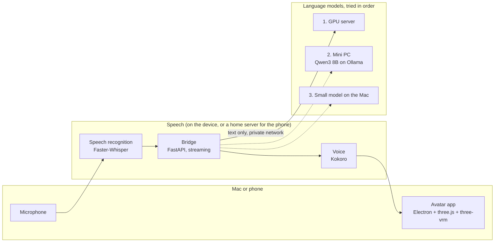

# Marina

**A private voice assistant with an animated 3D avatar, running entirely on hardware I own.**

You talk to Marina out loud and she answers in her own voice, with a face that
lip-syncs, reacts while you speak and shows when she is thinking. Speech
recognition and the voice run on the device in front of you. The language model
runs on my own machines, with automatic failover between them, and no AI cloud
service is involved at any point.

It runs as a macOS desktop app and as a phone web app, from the same codebase.


---

## What it can do today

| | |
| --- | --- |
| **Spoken conversation** | Talk naturally, or type. Replies start playing before the whole answer has been generated, sentence by sentence. |
| **General questions** | Answers from whatever language model it is connected to. |
| **Timers and reminders** | "Remind me in ten minutes to call back." |
| **Open links** | Opens web pages on the computer it runs on. |
| **Memory** | Can remember lasting facts across conversations. Off in the presentation profile. |
| **Look at the screen** | Optional: describes what's on screen using a vision model. Off by default. |
| **Phone app** | The same assistant in a phone browser, with its own microphone, over a private network. |
| **Stage view** | Full screen with large subtitles and the question shown on screen, for showing it to a room. |

## Where it could be used

These are the kinds of roles it is built towards. Each would need the assistant
connected to the organisation's own information (a knowledge base, ticketing,
visitor lists), which is the natural next step for the project.

| Role | What it would do |
| --- | --- |
| **Front desk and reception** | Greet visitors, answer common questions, give directions, check who is expected. |
| **IT service desk, first line** | Take routine questions (password resets, how-tos, known issues) and hand anything complex to a person. |
| **Staff onboarding and training** | A patient guide new starters can ask anything, as often as they like. |
| **Events and showrooms** | An approachable presence that talks to visitors and explains a product or service. |
| **Accessibility** | A voice-first way into services for people who find screens and forms hard. |
| **Regulated environments** | Anywhere data cannot go to a public AI service: public sector, healthcare, finance, legal. Because the model runs on hardware the organisation owns, conversations stay in-house. |

## Why it has an avatar

The avatar isn't decoration. In a spoken conversation, a face does several jobs
that a voice alone can't:

- **It shows what the system is doing.** She leans in and keeps eye contact
  while listening, glances away while thinking, and moves her eyebrows and head
  on stressed words while speaking. People know when to talk and when to wait,
  which is the biggest source of friction with plain voice assistants.
- **It makes speech easier to follow.** Lip sync and expression help in noisy
  places such as receptions and events, and help people who rely partly on
  lip-reading.
- **It is more approachable.** People are far more willing to start talking to a
  face than to a microphone icon, especially in a public space like a front
  desk or an event stand.
- **It gives a service a consistent identity.** The same character, voice and
  manner every time, which an organisation can choose to match its brand.
- **It is swappable.** Any VRM model works, so the character can be changed
  without touching the rest of the system.


---

## How it is built



**Desktop app.** An Electron app with a transparent, always-on-top window. The
avatar is a VRM model rendered with three.js and three-vrm. Packaged as a
self-contained `.app` and `.dmg` that carries its own Python runtime and models,
so it installs with a drag and runs with no setup.

**Bridge.** A FastAPI service that records and transcribes speech, sends the
text to a language model, splits the reply into sentences and voices each one as
it arrives, and streams audio, lip-sync data and animation cues back to the app.

**Language models with failover.** Any OpenAI-compatible endpoint works
(Ollama, llama.cpp, vLLM, LM Studio, OpenAI). Several can be configured; in
automatic mode it uses the first that answers and moves to the next one
mid-conversation if a machine goes down. A machine that fails is skipped for 30
seconds rather than retried on every message. Each can also be picked by hand
from the app's menu.

**Private networking.** The machines reach each other over Tailscale, including
a model server on a separate site reached through an SSH tunnel over a second
private network. Nothing is exposed to the public internet.

**Phone app.** The same interface served to a phone browser over HTTPS on the
private network, and installable to the home screen. Speech recognition and the
voice run in a small Proxmox container on a home server, so the phone only
records and plays audio.

**Presentation profile.** Personality and behaviour are configuration. The
profile shipped here is poised and concise, sticks to facts it has been given
about itself, never reads the clipboard, keeps no memory of guests, and doesn't
speak unprompted. Profiles can be switched live from the menu without a restart,
and each keeps its own conversation history.

**Animation.** Procedural rather than canned: breathing, weight shifts, natural
blinking and eye movement, hair physics, five-shape lip sync driven by the
audio spectrum, and gestures acted out from the reply text. The wave uses
inverse kinematics: it places the hand on a path beside the head and solves the
elbow and shoulder, which keeps the motion natural and the palm facing the
viewer.

## Privacy

- **The microphone audio never leaves the device it was recorded on.** Speech
  recognition and the voice are local. I verified this by watching every network
  connection through a full conversation: the only ones open were local.
- **Only the text of the conversation goes to the language model**, which runs
  on hardware I control, reached over an encrypted private network.
- **No third-party AI service is used anywhere.**
- The bridge listens only on the local machine; the phone app is reachable only
  inside the private network.

## Performance

Measured on the hardware this runs on day to day.

| | |
| --- | --- |
| Mini PC (Beelink SER9, Qwen3 8B) | First word of a reply in 0.3 to 0.6 s |
| Failover to the next machine | Under a second when a machine refuses the connection; about 6 s when it is powered off |
| Speech recognition, phone path | 1.2 s for a 6-second question, on a 2015 laptop-class CPU (Intel i5-6300U) |
| Voice, same CPU | 1.3x faster than real time, so speech never stalls between sentences |
| Phone, question to first spoken word | About 3 to 5 s end to end |
| Voice on the Mac (M-series) | 3.3x faster than real time; a typical first sentence is ready in 0.3 to 1 s |

The phone path deliberately runs on old, low-power hardware to show it doesn't
need a GPU.


---

## Running it

Requires an Apple Silicon Mac on macOS 13 or later, and a language model
endpoint. The simplest is [Ollama](https://ollama.com) on the same Mac:

```bash
ollama pull llama3.2:3b
```

Then set up and run from a checkout:

```bash
./setup-mac.sh
```

```bash
cp character_config.example.yaml character_config.yaml
```

```bash
./start-bridge.sh
```

```bash
./start-app.sh
```

`setup-mac.sh` installs Python 3.12, the dependencies and the voice model. Put a
`.vrm` avatar at `app/models/model.vrm`, or pick one from the app. VRoid Studio
exports these via **Export → VRM**.

To build the standalone app and installer:

```bash
./build-app.sh
```

### Keyboard shortcuts

| | |
| --- | --- |
| ⌘⇧Space, or Space in the window | Start and stop listening |
| ⌘⇧F | Stage view |
| ⌘⇧. | Interrupt her |
| ⌘⇧H | Show or hide |

### Phone app

Set `web.enabled: true` and run the bridge on an always-on Linux machine. Put it
behind something that provides HTTPS, such as `tailscale serve`, since phone
browsers only allow the microphone on secure pages. Then open the address on the
phone and use **Add to Home Screen**.

### Adding language model servers

Add more endpoints under `llm` in `character_config.yaml`. The example config
shows a main server, extra machines and a local fallback.

## Project layout

```
server/
  marina_server.py          the bridge: HTTP API, streaming replies, phone uploads
  process/backend.py        the list of language model servers and failover order
  process/llm_funcs/        chat client, failover, tool calls, history
  process/asr_func/         Faster-Whisper, microphone recording, interruption detection
  process/tts_func/         voice synthesis (Kokoro, or GPT-SoVITS)
  process/text_func/        splits replies into speakable sentences and gestures
  process/web.py            serves the avatar to phone browsers
  process/config.py         configuration and live profile switching
app/
  main.js                   Electron: window, menu bar, shortcuts, stage view
  renderer/app.js           avatar, animation, lip sync, inverse kinematics, UI
  renderer/web-shim.js      lets the same UI run in a phone browser
build-app.sh                builds the self-contained .app and .dmg
```

## Roadmap

- Connect to an organisation's own documents, so answers come from its knowledge
  base rather than the model's general knowledge.
- Integrations for ticketing and visitor management.
- One shared memory across the desktop and phone.
- Wake word, so it can be hands-free.
- More languages for speech and voice.

## Credits

Started from [rayenfeng/riko_project](https://github.com/rayenfeng/riko_project),
a terminal voice-chat pipeline. The avatar app, failover, phone app, animation
system, presentation profile and packaging were built on top of it.

- [three-vrm](https://github.com/pixiv/three-vrm), [three.js](https://threejs.org)
  and [Electron](https://www.electronjs.org)
- [Faster-Whisper](https://github.com/SYSTRAN/faster-whisper) for speech recognition
- [Kokoro-82M](https://huggingface.co/hexgrad/Kokoro-82M) via
  [kokoro-onnx](https://github.com/thewh1teagle/kokoro-onnx) for the voice
- [Ollama](https://ollama.com) for local language models
- [VRoid Studio](https://vroid.com/en/studio), where the character was made

MIT licensed.
