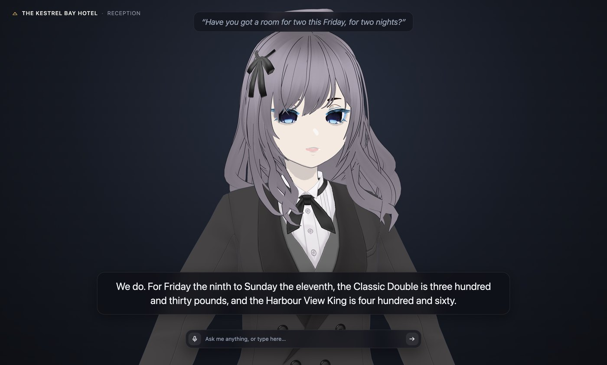
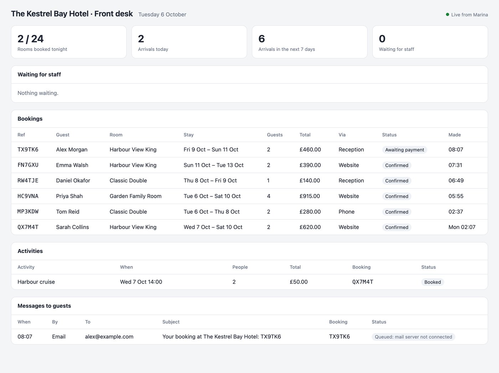
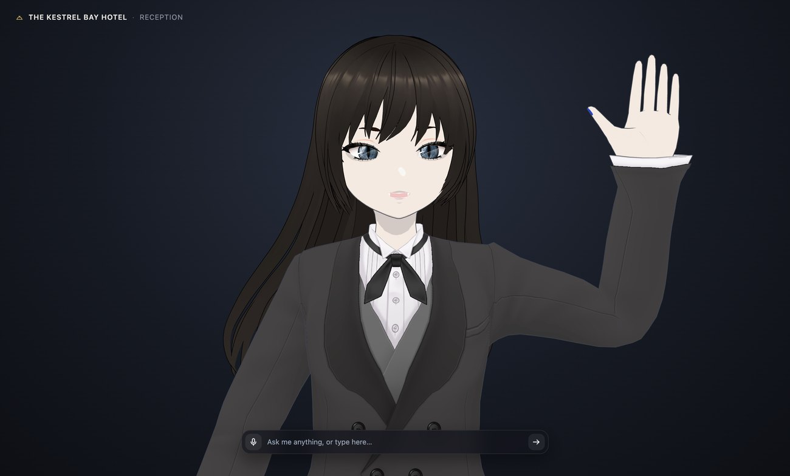
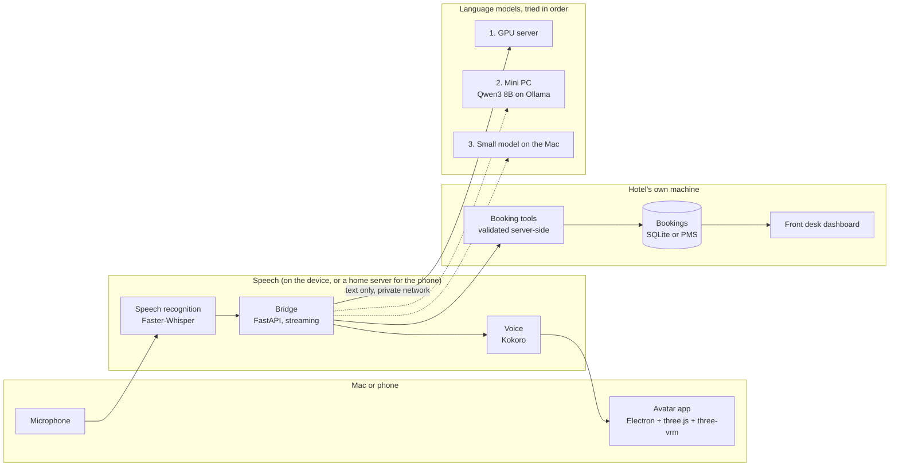
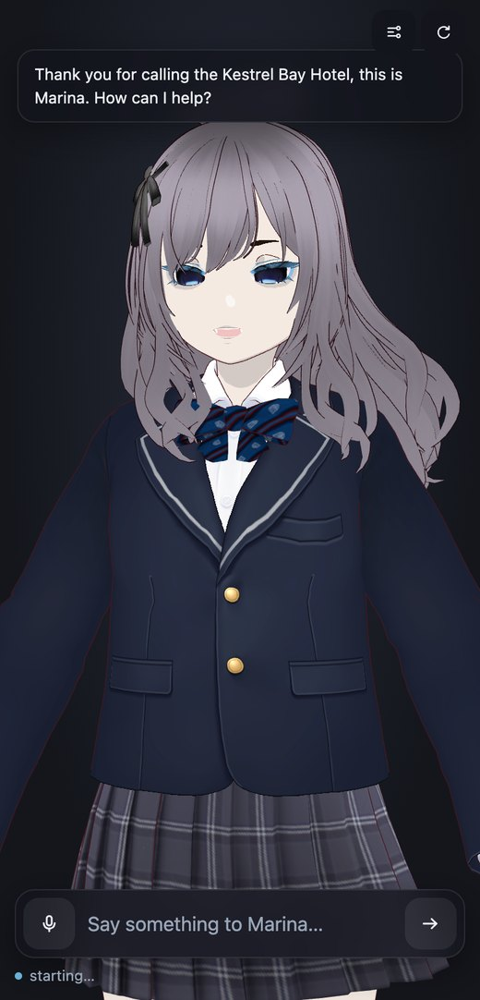

# Marina

**A virtual receptionist for hotels, with an animated 3D avatar, running
entirely on the hotel's own hardware.**

Guests talk to Marina at reception or over the phone. She checks rooms and
prices, takes bookings, books activities, answers questions about the hotel,
and passes anything else to a member of staff. Speech recognition and her voice
run on the device at the desk, the language model runs on the hotel's own
machines, and no AI cloud service is involved at any point.



---

## What she does

| | |
| --- | --- |
| **Rooms and prices** | Checks what's free for any dates and quotes the total, including weekend rates. |
| **Bookings** | Reads the details back, waits for a yes, books, and gives a reference that's easy to say aloud. Rooms are held until the guest pays through a secure link. |
| **Changes and cancellations** | Needs the booking reference and the surname. Explains the cancellation policy before cancelling. |
| **Activities** | Lists times with spaces left, and books them onto a guest's stay. |
| **Questions about the hotel** | Answers from the hotel's own facts file: check-in times, parking, pets, breakfast, the spa. Says so when she doesn't know. |
| **Handing over** | Complaints, special requests, emergencies and "can I speak to someone" go straight to staff. |
| **Two desks** | A Reception profile for guests in person and a Phone line profile for callers, switchable live. |
| **Front desk dashboard** | Staff see every booking, activity and hand-over as it happens. |



## Why it has an avatar

The avatar isn't decoration. In a spoken conversation, a face does several jobs
that a voice alone can't:

- **It shows what's happening.** She leans in and keeps eye contact while
  listening, glances away while thinking, and moves with her speech. Guests know
  when to talk and when to wait.
- **It makes speech easier to follow** in a busy lobby, and helps guests who
  rely partly on lip-reading. Everything she says is also captioned.
- **It's more approachable** than a microphone icon, especially at a front desk.
- **It's the hotel's own character.** Any VRM model, voice and personality can
  be used, so it can match the hotel's brand.



## Guest data and safety

- **The hotel owns all of it.** Bookings live on the hotel's own machine.
  Conversations never go to an AI company and are never used for training.
- **Microphone audio never leaves the device.** It's transcribed locally and
  discarded; nothing is recorded.
- **Minimal data.** A booking holds a name, an email or phone number, and the
  stay. Card details are never taken: payment is by a secure link.
- **No memory of guests.** After a short pause at the desk, the next guest
  starts a fresh conversation, so nothing carries over.
- **Bookings are protected.** Looking up, changing or cancelling needs both the
  reference and the surname. There's no way to ask her for a list of guests.
- **Right to erasure.** A guest's personal details can be wiped while the stay
  itself is kept for the hotel's accounts.
- **On topic.** She only helps with the hotel, and has no ability to browse,
  open links or read the clipboard. Messages are length-capped, and bookings
  per desk are rate-limited so no one can tie up the rooms.
- **Logs record what happened, not what was said.** Names, emails and
  booking details stay out of the log unless the hotel turns
  `hotel.log_conversations` on.
- **Private network only.** Machines talk over an encrypted private network, and
  the staff dashboard only opens on the front desk computer unless a staff key
  is set.

The hotel remains the data controller under UK GDPR, and should publish its own
privacy notice and tell guests they're speaking to an AI.

### Where the booking data lives

- **On the hotel's machine** (today): a SQLite database next to Marina.
- **In a cloud property management system** (Mews, Cloudbeds, Opera Cloud and
  so on): the PMS stays the single source of truth. Marina checks and books
  through its API, keeps no copy of the guest list, and fetches one booking at
  a time, only after the reference and surname match. The PMS is already the
  hotel's processor under its existing agreement.
- **Hybrid**: for example rooms in the cloud PMS with activities and staff
  requests kept locally, or a local copy of availability so that during an
  internet outage she can take provisional requests and queue them until the
  PMS is reachable again.

Each of these plugs in behind the same `BookingSystem` interface, so the
conversation side doesn't change. The cloud and hybrid adapters are not built
yet.

## How it is built



**Desktop app.** An Electron app with a transparent, always-on-top window. The
avatar is a VRM model rendered with three.js and three-vrm. Packaged as a
self-contained `.app` and `.dmg` that carries its own Python runtime and models,
so it installs with a drag and runs with no setup.

**Bridge.** A FastAPI service that records and transcribes speech, sends the
text to a language model, splits the reply into sentences and voices each one as
it arrives, and streams audio, lip-sync data and animation cues back to the app.

**Language models with failover.** Any OpenAI-compatible endpoint works
(Ollama, llama.cpp, vLLM, LM Studio, OpenAI). Several can be configured; in
automatic mode it uses the first that answers and moves to the next one
mid-conversation if a machine goes down. A machine that fails is skipped for 30
seconds rather than retried on every message. Each can also be picked by hand
from the app's menu.

**Private networking.** The machines reach each other over Tailscale, including
a model server on a separate site reached through an SSH tunnel over a second
private network. Nothing is exposed to the public internet.

**Phone app.** The same interface served to a phone browser over HTTPS on the
private network, and installable to the home screen. Speech recognition and the
voice run in a small Proxmox container on a home server, so the phone only
records and plays audio.

**Hotel layer.** The hotel's facts, rooms, rates, policies and activities live
in one file, `hotel.yaml`. Marina answers only from it, and books through a
small set of tools (check availability, book, look up, change, cancel, book an
activity, hand over to staff) that validate everything server-side: dates,
capacity, opening days, and the surname on a booking. Bookings go into a SQLite
database on the hotel's own machine. A property management system plugs in by
implementing the same interface (`BookingSystem` in
`server/process/hotel/store.py`).

**Reception and phone profiles.** Personality and behaviour are configuration.
The Reception profile greets guests in person; the Phone line profile works by
voice alone, reading back details and spelling references. Both switch live from
the menu, keep separate conversations, and record which desk each booking came
from. Neither reads the clipboard, opens links, keeps memory of guests, or
speaks unprompted.

**Animation.** Procedural rather than canned: breathing, weight shifts, natural
blinking and eye movement, hair physics, five-shape lip sync driven by the
audio spectrum, and gestures acted out from the reply text. The wave uses
inverse kinematics: it places the hand on a path beside the head and solves the
elbow and shoulder, which keeps the motion natural and the palm facing the
viewer.
## Performance

Measured on the hardware this runs on day to day.

| | |
| --- | --- |
| Mini PC (Beelink SER9, Qwen3 8B) | First word of a reply in 0.3 to 0.6 s |
| Failover to the next machine | Under a second when a machine refuses the connection; about 6 s when it is powered off |
| Speech recognition, phone path | 1.2 s for a 6-second question, on a 2015 laptop-class CPU (Intel i5-6300U) |
| Voice, same CPU | 1.3x faster than real time, so speech never stalls between sentences |
| Phone, question to first spoken word | About 3 to 5 s end to end |
| Voice on the Mac (M-series) | 3.3x faster than real time; a typical first sentence is ready in 0.3 to 1 s |

The phone path deliberately runs on old, low-power hardware to show it doesn't
need a GPU.



---

## Running it

Requires an Apple Silicon Mac on macOS 13 or later, and a language model
endpoint. The simplest is [Ollama](https://ollama.com) on the same Mac. Tool
calling needs a model that supports it; Qwen3 8B works well:

```bash
ollama pull qwen3:8b
```

Then from a checkout:

```bash
./setup-mac.sh
```

```bash
cp character_config.example.yaml character_config.yaml
```

```bash
./start-bridge.sh
```

```bash
./start-app.sh
```

Set `llm.model` to the model you pulled. On first run `hotel.example.yaml` is
copied to `hotel.yaml`: fill that in with the hotel's own rooms, rates,
policies, facilities and activities. Put a `.vrm` avatar at
`app/models/model.vrm`, or pick one from the app.

The front desk dashboard is at `http://127.0.0.1:8775/staff`. To reset the
bookings and load a few example stays for a demo:

```bash
python server/hotel_demo.py
```

To build the standalone app and installer:

```bash
./build-app.sh
```

### Keyboard shortcuts

| | |
| --- | --- |
| ⌘⇧Space, or Space in the window | Start and stop listening |
| ⌘⇧F | Stage view, full screen for a reception display |
| ⌘⇧. | Interrupt her |
| ⌘⇧H | Show or hide |

## Status

Working today: everything above, in English, with bookings in Marina's own
database. Not yet built:

- **A real phone number.** The Phone line profile shows how she behaves on a
  call; connecting a number needs a telephony service such as Twilio or SIP.
- **Payment links.** The booking flow tells the guest a link is coming, but
  sending it needs a payment provider.
- **Property management systems.** The interface is there; adapters for Opera,
  Mews or Cloudbeds aren't.
- **Other languages.** The model and voice support several; speech recognition
  and testing are needed to switch them on.
- **Several conversations at once.** One setup handles one guest at a time.
- **Expiry of unpaid bookings.**

On small models (8B), multi-step bookings occasionally slip, for example
quoting without checking first. A larger model on a GPU server, together with
the read-back-and-confirm step, is the recommended setup.

## Project layout

```
hotel.example.yaml          the hotel's facts, rooms, rates and activities
server/
  marina_server.py          the bridge: HTTP API, streaming replies, phone uploads
  hotel_demo.py             reset the bookings with example stays
  process/hotel/            facts, booking store, guest tools, staff dashboard
  process/backend.py        language model servers and failover order
  process/llm_funcs/        chat client, failover, tool calls, history
  process/asr_func/         speech recognition and recording
  process/tts_func/         voice synthesis
  process/web.py            serves the avatar to phone browsers
  process/config.py         configuration and live profile switching
app/
  main.js                   Electron: window, menu bar, shortcuts, stage view
  renderer/app.js           avatar, animation, lip sync, inverse kinematics, UI
build-app.sh                builds the self-contained .app and .dmg
```

## Credits

Started from [rayenfeng/riko_project](https://github.com/rayenfeng/riko_project),
a terminal voice-chat pipeline. The avatar app, failover, phone app, animation
system, hotel layer and packaging were built on top of it.

- [three-vrm](https://github.com/pixiv/three-vrm), [three.js](https://threejs.org)
  and [Electron](https://www.electronjs.org)
- [Faster-Whisper](https://github.com/SYSTRAN/faster-whisper) for speech recognition
- [Kokoro-82M](https://huggingface.co/hexgrad/Kokoro-82M) via
  [kokoro-onnx](https://github.com/thewh1teagle/kokoro-onnx) for the voice
- [Ollama](https://ollama.com) for local language models
- [VRoid Studio](https://vroid.com/en/studio), where the character was made

MIT licensed.
